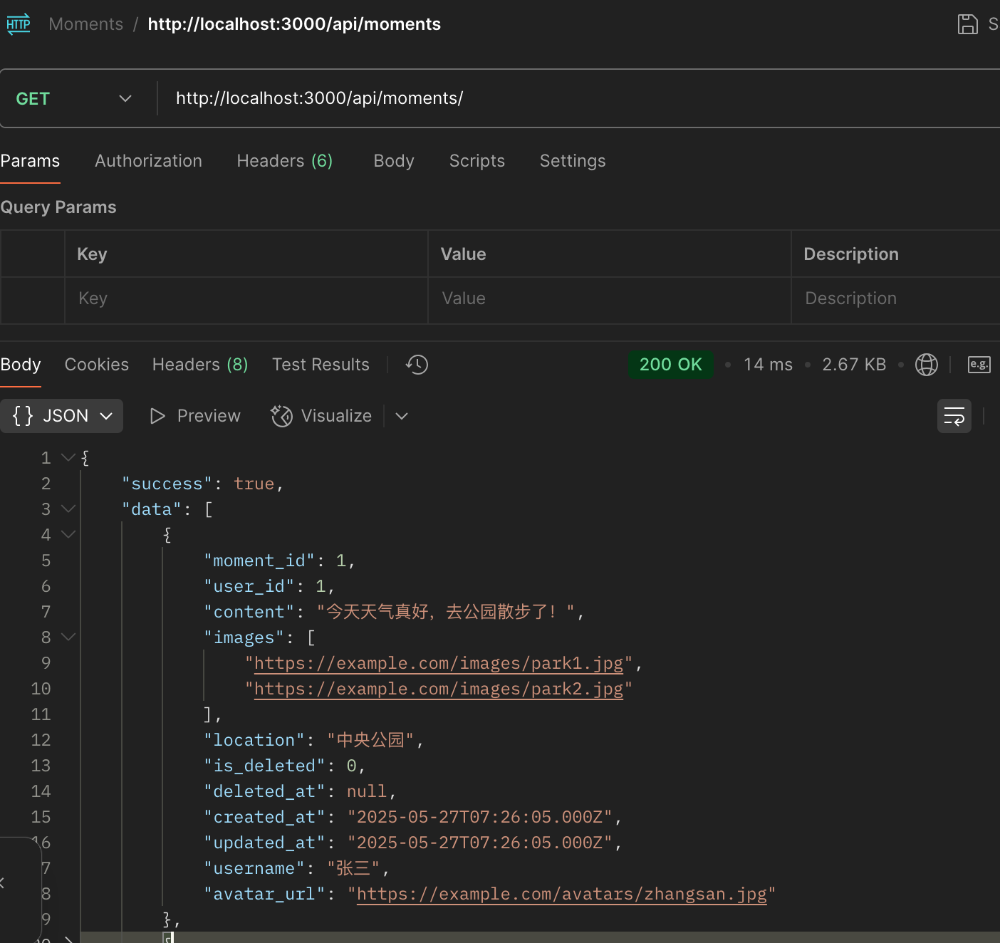

# MomentsServer
## 使用Express创建一个简单的后端服务，
1、可以请求得到所有的朋友圈列表数据
2、可以根据用户id获取朋友圈详情

## 运行配置：
1、数据库使用 mysql 8.0
2、本地运行请先配置好数据库，并依次运行两个查询sql reateDB.sql和 inserData.sql
3、.evn 文件中修改为你本地的数据库配置
```
    DB_HOST=localhost        # 数据库主机地址
    DB_USER=root            # 数据库用户名
    DB_PASSWORD=0000  # 数据库密码
    DB_NAME=moments      # 数据库名称
```
4、配置完成 终端运行 npm install 安装依赖，再运行 npm start启动应用。
## 支持两个接口：
http://localhost:3000/api/moments/
http://localhost:3000/api/moments/:id



